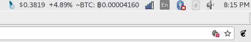

# bitshares-indicator
bitshares-indicator by @happyconcepts will monitor the price of Bitshares.

Please report bugs and suggestions as [issues](https://github.com/happyconcepts/bitshares-indicator/issues) via the Github repository.

# How to Load bitshares-indicator
This software has been tested with python 2.7. Navigate to the directory containing the project and type the following at the command line:
`python bitshares_indicator.py`

# How to Support bitshares-indicator
You can make a free Bitshares account at [https://wallet.bitshares.org/?r=buy-bitcoin](https://wallet.bitshares.org/?r=buy-bitcoin) or if you prefer Russian you can set up an account on the RuDEX at [https://market.rudex.org/?r=buy-bitcoin](https://market.rudex.org/?r=buy-bitcoin)

Price data is provided by the Binance exchange API. You can make a free Binance trading account at [https://www.binance.com/?ref=22113850](https://www.binance.com/?ref=22113850)

# Testing
We use unittest for testing which works well in Python 2.x environments. Unit test script names are prefixed with test_ in order to facilitate automated  test discovery!

# Compatibility
This unofficial application indicator uses gtk3 and has been tested on Ubuntu 16.04 (Unity) desktop.

So far, this indicator is not compatible with newer Ubuntu versions 17.04, 17.10 and 18.04.

# Contributing to bitshares-indicator
Your contribution to this open source project is welcome!

# Donating to bitshares-indicator
Your donation to this open source ~~labor of love~~ project is welcome!

Bitcoin/BTC: `1FZhqidv4oMRoiry9mGASFL7JSgdB27Mmn`

Ether/ETH: `0x496674877679f6a4812bb7c3aa84fb67683fb85b`

Neo/NEO: `ANtzxy3uv3zYpKVfDfFcBr4WBHdmo1zFMx`

BitcoinCash/BCC: `1FZhqidv4oMRoiry9mGASFL7JSgdB27Mmn`

Bitshares/BTS: `bitshares-indicator`
